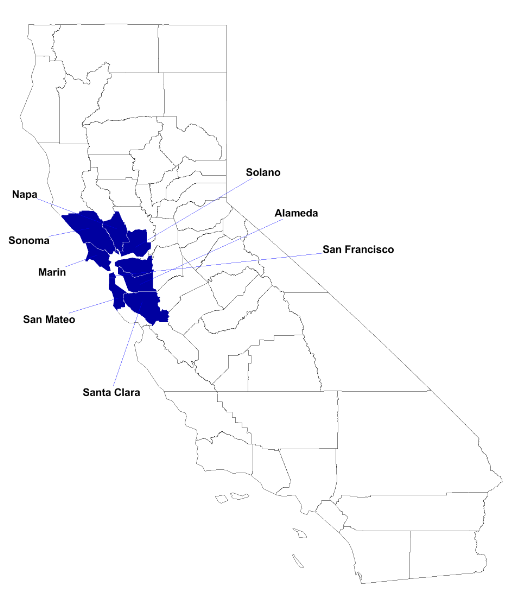
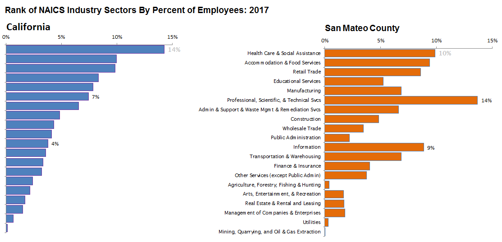
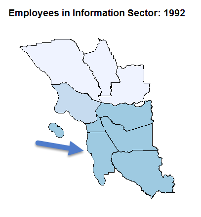
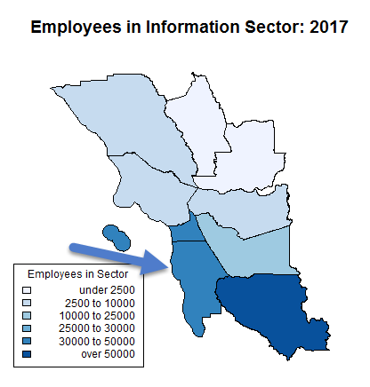
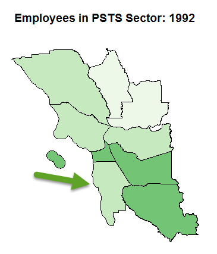
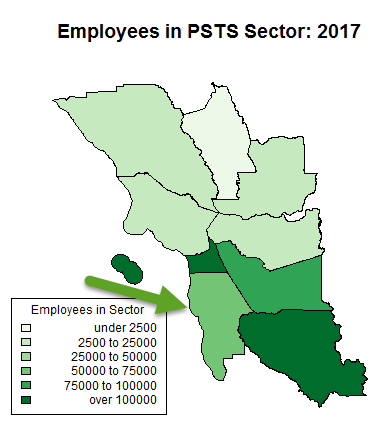
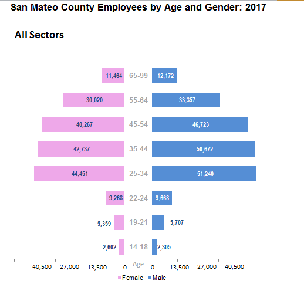
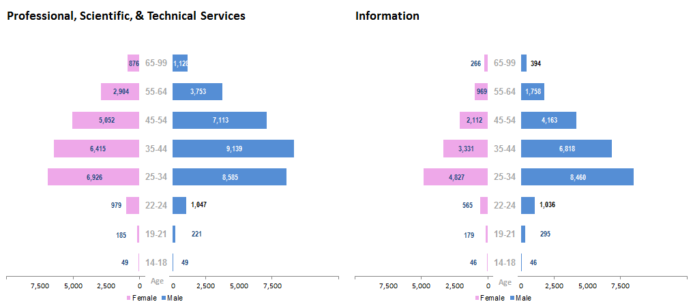
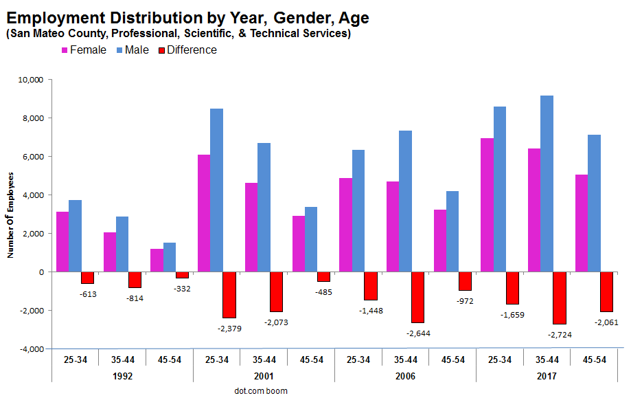
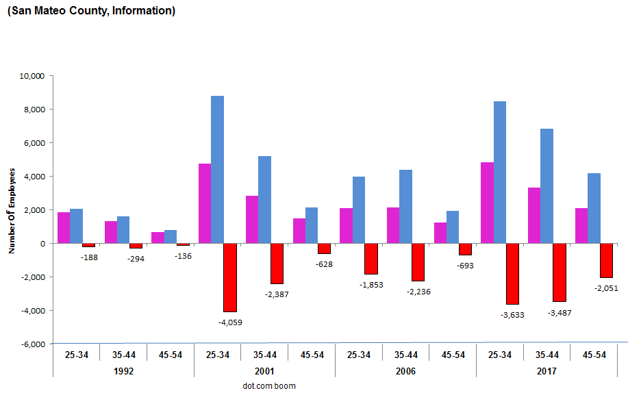

Link to website: https://juli2017.github.io/SanMateoCountyEmployment/

# For Whom Tech Booms: Visualizing the past 25 years of job growth in San Mateo County
Project for MOOC Data Visualization for Storytelling and Discovery

U.S. Census data were visualized to compare changes in the distribution of employment in San Mateo County from 1992-2017.

San Mateo County (SMC) is located in Northern California, in the San Francisco Bay Area, between the heart of Silicon Valley in Santa Clara County and San Francisco County.  Fast-growing high tech companies have located in the county in the past 25 years, along with existing biotech, finance, and gaming software companies (<a href="https://juli2017.github.io/EmployerPointMap/">Map of large employers in SMC</a>).  

  

<a href="https://qwiexplorer.ces.census.gov/static/explore.html#x=0&g=0">U.S. Census Data downloaded from QWI explorer</a>  

<a href="https://www.bls.gov/iag/tgs/iag_index_naics.htm">Bureau of Labor Statistics NAICS/Industry Sector Codes</a>

The rank of industry/sector by number of employees differs between San Mateo County and the state of California.  The percent of workers in the Professional, Scientific, & Technical Services (PSTS; NAICS = 54) industry is 14% in San Mateo County, but only 7% in California.  Similarly, the Information Sector (NAICS = 51) has over twice the percentage of workers in SMC as there are statewide.  

## Trends in Bay Area County Employment by Sector: 1992 vs. 2017

  
   

  
   

San Mateo County and its adjacent counties have all experienced growth in jobs in the Professional, Scientific & Technical Services and Information sectors since 1992, but the number of employees in these sectors varies across counties.

## Trends in San Mateo County Employment by Sector: 1992-2017

  

There has been a dramatic change in the relative importance of different industries in San Mateo County in the past 25 years.  There was no clear dominant industry in 1992.  The Professional, Scientific, & Technical Services and Information sectors show the most dramatic increases in number of employees over time in the past 25 years, and now dominate the jobs in San Mateo County.  

  

Visualizing the percent change by sector in number of employees over time, relataive to the number in 1992, it is striking that the top 3 industries in 1992 (Retail Trade, Manufacturing, Transportation and Warehousing) were not part of the job growth as seen in 2017.  The Information sector, though showing an over 300% growth rate, showed much more volatility over time.
# Age and Gender distribution of workers in San Mateo County

  
The job market is dominated by fewer industries in 2017.  Are working aged people of all ages and gender equally likely to benefit from the increased employment opportunities in the county?  The Butterfly Charts show how employees are spread out among age groups and between genders.  For All Sectors of employment in San Mateo County in 2017, the figure has a symmetry across age groups in spite of a slight over-representation of males.

  

For the Professional, Scientific & Technical Services sector, there is a more abrupt attenuation of employment between the 45-54 and 55-64 age groups, and a larger differential between female and male employees in every age group.  This is exagerated even more for the Information sector, where the abrupt decline in employees occurs between the 25-34 and 35-44 age groups.  The asymmetry between males and females in employment is more pronounced, and there is no symmetry horizontally or vertically.

                 
              

Over time, the absolute difference in employees by gender for the main employment age groups (25-54 years old) within the Professional, Scientific, & Technical Services and Information Sectors in San Mateo County has increased significantly since 1992.  During the dot-com bubble in 2001, the younger age group (25-34) had a large disparity between males and females; while at the bottom of the burst bubble in 2006, the 35-44 year old age group showed the largest disparity, which has continued into 2017.  While males have always been over-represented in the PSTS sector, the difference in employment by gender for these highly skilled, highly paid jobs is increasing over time in San Mateo County. The predominance of younger, male employees in the Information sector continues in 2017.

 

<iframe src='https://public.flourish.studio/visualisation/70798/embed' frameborder='0' scrolling='no' style='width:70%;height:600px;'></iframe>

NAICS Codes: 31-33:Manufacturing; 44-45: Retail Trade; 48-49: Transportation and Warehousing; 51: Information; 54: Professional, Scientific and Technical Services; 62: Health Care and Social Assistance; 72: Accomodation and Food Service

