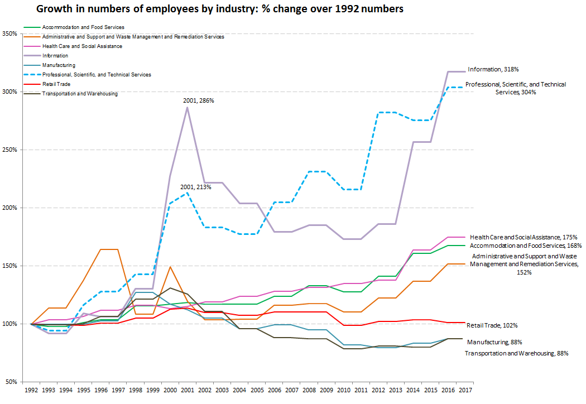

Link to website: https://juli2017.github.io/SanMateoCountyEmployment/

# Changes in the distribution of employees by industry in San Mateo County, CA in the last 25 years
Project for MOOC Data Visualization for Storytelling and Discovery

U.S. Census data were visualized to compare changes in the distribution of employment in San Mateo County from 1992-2017.

San Mateo County (SMC) is located in Northern California, in the San Francisco Bay Area, between the heart of Silicon Valley in Santa Clara County and San Francisco County.  Fast-growing high tech companies have located in the county in the past 25 years, along with biotech, finance, and gaming software companies (<a href="https://juli2017.github.io/EmployerPointMap/">Map of large employers in SMC</a>).  The change over time in which industries employ the majority of workers in the county reflects the recent emphasis on High Tech jobs in this part of the state.  For the latest year of data, compared to the state as a whole , the percent of workers in the Professional, Scientific, & Technical Services industry is 14% in San Mateo County, but only 7% in California.  Similarly, the Information Sector has over twice the percentage of workers in SMC as there are in California.

  

<a href="https://qwiexplorer.ces.census.gov/static/explore.html#x=0&g=0">U.S. Census Data downloaded from QWI explorer</a>

<a href="https://www.bls.gov/iag/tgs/iag_index_naics.htm">Bureau of Labor Statistics NAICS/Industry Sector Codes</a>

## Trends in San Mateo County Employment by Sector: 1992-2017

  

There has been a dramatic change in the relative importance of different industries in San Mateo County in the past 25 years.  There was no clear dominant industry in 1992, so more diversity in types of jobs available.  The Professional, Scientific, & Technical Services (NAICS code 54, PSTS) and Information sectors show the most dramatic increases in number of employees over time in the past 25 years, and now dominate the employment numbers.  

  

Visualizing the percent change by sector in number of employees over time, relataive to the number in 1992, it is striking that the top 3 industries in 1992 (Retail Trade, Manufacturing, Transportation and Warehousing) were not part of the job growth as seen in 2017.  The Information sector, though showing an over 300% growth rate, showed much more volatility over time.
# Current Age and gender distribution of workers in San Mateo County

Comparing the 2017 Census data for San Mateo County for all sectors to the profile for the Professional, Scientific, & Technical Services industry, shows the breakdown of employees by age group and gender.

  

It looks as though there is a bias towards male employees in the middle age groups for the PSTS industry.

# Change in age and gender distribution for PSTS in San Mateo County

