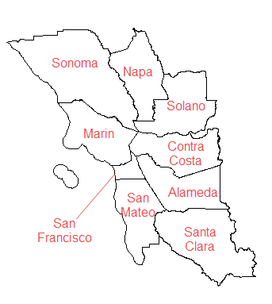
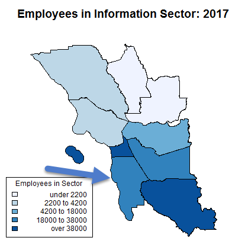
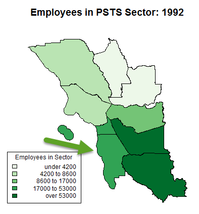

Link to website: https://juli2017.github.io/SanMateoCountyEmployment/

# Changes in the distribution of jobs in San Mateo County, CA in the last 25 years
Project for MOOC Data Visualization for Storytelling and Discovery

U.S. Census data were visualized to compare changes in the distribution of employment in San Mateo County from 1992-2017.

San Mateo County (SMC) is located in Northern California, in the San Francisco Bay Area, between the heart of Silicon Valley in Santa Clara County and San Francisco County.  Fast-growing high tech companies have located in the county in the past 25 years, along with existing biotech, finance, and gaming software companies (<a href="https://juli2017.github.io/EmployerPointMap/">Map of large employers in SMC</a>).  

  

<a href="https://qwiexplorer.ces.census.gov/static/explore.html#x=0&g=0">U.S. Census Data downloaded from QWI explorer</a>  

<a href="https://www.bls.gov/iag/tgs/iag_index_naics.htm">Bureau of Labor Statistics NAICS/Industry Sector Codes</a>

The change over time in the industries that employ the majority of workers in the county coincides with the recent emphasis on High Tech jobs in this part of the state.  For the latest year of data, compared to the state as a whole , the percent of workers in the Professional, Scientific, & Technical Services (PSTS; NAICS = 54) industry is 14% in San Mateo County, but only 7% in California.  Similarly, the Information Sector (NAICS = 51) has over twice the percentage of workers in SMC as there are statewide.  

## Trends in Bay Area County Employment by Sector: 1992 vs. 2017

  
   

  
   

San Mateo County had fewer Information Sector employees than the adjacent San Francisco and Santa Clara counties in both 1992 and 2017.

## Trends in San Mateo County Employment by Sector: 1992-2017

  

There has been a dramatic change in the relative importance of different industries in San Mateo County in the past 25 years.  There was no clear dominant industry in 1992.  The Professional, Scientific, & Technical Services and Information sectors show the most dramatic increases in number of employees over time in the past 25 years, and now dominate the jobs in San Mateo County.  

  

Visualizing the percent change by sector in number of employees over time, relataive to the number in 1992, it is striking that the top 3 industries in 1992 (Retail Trade, Manufacturing, Transportation and Warehousing) were not part of the job growth as seen in 2017.  The Information sector, though showing an over 300% growth rate, showed much more volatility over time.
# Age and Gender distribution of workers in San Mateo County

The job market is dominated by fewer industries in 2017.  Are working aged people of all ages and gender equally likely to benefit from the increased employment opportunities in the county?

  

With few exceptions, males dominate all age groups in number of employees in 2017.

 

Over time, the absolute difference in employees by gender for the main employment age groups (25-54 years old) within the Professional, Scientific, & Technical Services Sector in San Mateo County has increased significantly since 1992.  During the dot-com bubble in 2001, the younger age group (25-34) had a large disparity between males and females; while at the bottom of the burst bubble, the 35-44 year old age group showed the largest disparity, which has continued into 2017.  While males have always been over-represented in the PSTS sector, the difference in employment by gender is increasing over time in San Mateo County. 

